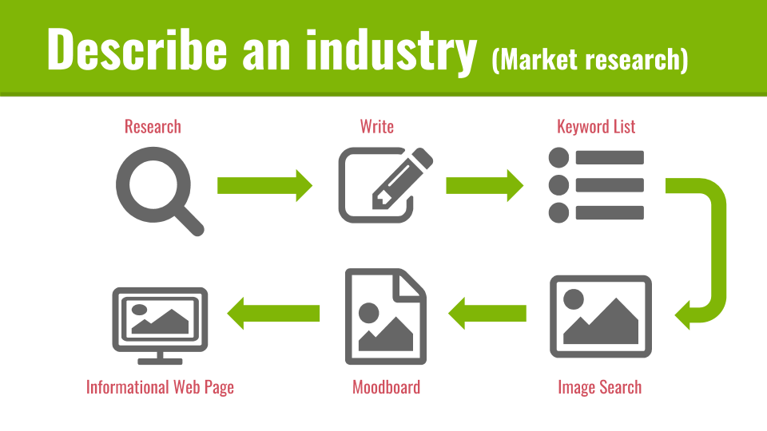

#Describe an industry# (Market research)

You are going to research and write about your client’s industry. The purpose of this research and writing is to help you: 
1. Understand your client
2. Communicate with them
3. Create better content for their Website and Online Marketing campaigns

Entrepreneurial skills used: Interviewing, writing, and thinking visually 

patinoweb/images/OMWEB-wk15-industry-research_project-flow.png

